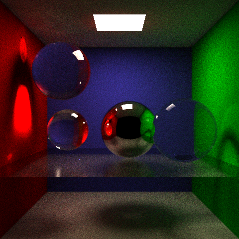
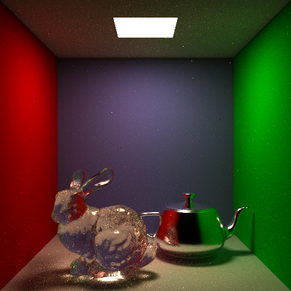
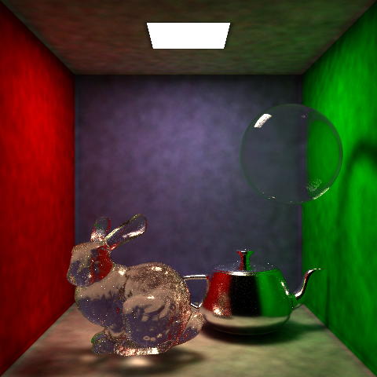
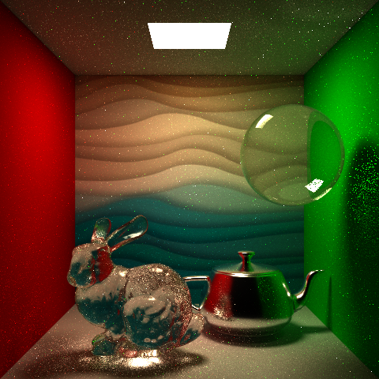
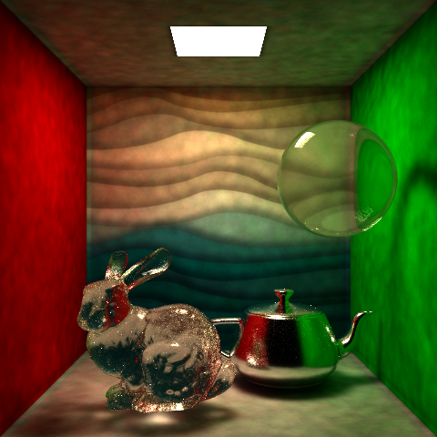

# CSE 168 Final Project

## Project Proposal
1. Add refractions to GGX model
   * References: 
     * [Microfacet Models for Refraction through Rough Surfaces](https://www.cs.cornell.edu/~srm/publications/EGSR07-btdf.pdf)
     * [Reflections and Refractions in Ray Tracing](https://graphics.stanford.edu/courses/cs148-10-summer/docs/2006--degreve--reflection_refraction.pdf)
2. Add support for `.obj` files
3. Texture mapping
4. Photon mapping
   * References: 
     * [A Practical Guide to Global Illumination using Photon Maps](https://graphics.stanford.edu/courses/cs348b-00/course8.pdf)
     * [Photon Mapping (Global Illumination)](http://www.cs.cmu.edu/afs/cs/academic/class/15462-s15/www/project/p4photon.pdf)

## Milestone
1. implemented refractions of transparent objects in GGX BRDF importance sampling with some bugs on next event estimation.

[Scene1](./scenes/cornell-refraction.test) | [Scene2](./scenes/cornell-refraction2.test)
--- | ---
 | 

2. Load `.obj` files into the scene.

|[Scene](./scenes/obj-loader.test)|
|---|
||

3. Photon mapping
  
|[Scene](./scenes/cornell-photon.test)|
|---|
||

4. Texture mapping

|[Path tracing](./scenes/texture.test)|[Photon mapping](./scenes/texture-photon.test) |
|---| --- |
| 2048 spp, MIS |512 spp, 4M photons, 0.04 radius|
|||

## Documentation

Transparent object rendered with GGX refraction model:
```
brdf ggx-refraction
ior [float] # eta0 = front face index of refraction
            # eta1 = back face index of refraction
            # ior = eta0 / eta1, default = 1.0
```
Load `.obj` file into the scene:
```
obj [filename.obj] # use the same commands to specify transforms and material.
                   # the program will automatically scale and center the model 
                   # so that the model is within the cube [-1,1]x[-1,1]x[-1,1].
```

Photon mapping:
```
integrator photonmapping
ppl [int] # number of photons per light
          # default is 100,000
                   # default is 50
photonSearchRadius [float] # photon search radius
```

Load textures:
*In `.test` files*
```
texture [textureFile.ppm] # texture file, only support one texture for a scene
texCoord [x] [y] # define texture coordinates
texTri [v1] [v2] [v3] [t1] [t2] [t3] # define triangles with textures
```

*In `.obj` files*
```
vt [texCoord.x] [texCoord.y] # define texture coordinates
f v1/t1/vn1 v2/t2/vn2 v3/t3/vn3 # define triangle faces with vertices, texture coordinates, and normals
```