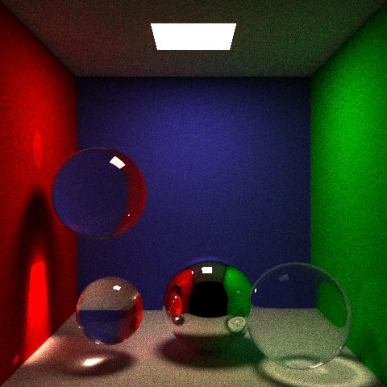

# CSE 168 Final Project

## Project Proposal
1. Add refractions to GGX model
   * References: 
     * [Microfacet Models for Refraction through Rough Surfaces](https://www.cs.cornell.edu/~srm/publications/EGSR07-btdf.pdf)
     * [Reflections and Refractions in Ray Tracing](https://graphics.stanford.edu/courses/cs148-10-summer/docs/2006--degreve--reflection_refraction.pdf)
2. Add support for `.obj` files
3. Texture mapping
4. Photon mapping
   * References: 
     * [A Practical Guide to Global Illumination using Photon Maps](https://graphics.stanford.edu/courses/cs348b-00/course8.pdf)
     * [Photon Mapping (Global Illumination)](http://www.cs.cmu.edu/afs/cs/academic/class/15462-s15/www/project/p4photon.pdf)

## Milestones
1. implemented refractions of transparent objects in GGX BRDF importance sampling with some bugs on next event estimation.

[Scene1](./scenes/cornell-refraction.test) | [Scene2](./scenes/cornell-refraction2.test)
--- | ---
 | 

2. Load `.obj` files into the scene.

|[Scene](./scenes/obj-loader.test)|
|---|
||

3. Photon mapping
  
|[Scene](./scenes/cornell-photon.test)|
|---|
||

4. Texture mapping

|[Path tracing (MIS)](./scenes/texture.test)|[Photon mapping](./scenes/texture-photon.test) | [Path tracing (NEE off)](./scenes/texture-nee-off.test)
|---| --- | --- |
| 2048 spp, MIS |512 spp, 4M photons, 0.04 radius| 4096 spp, NEE off |
|||

## Documentation

#### Transparent object rendered with GGX refraction model
```
brdf ggx-refraction
ior [float] # eta0 = front face index of refraction
            # eta1 = back face index of refraction
            # ior = eta0 / eta1, default = 1.0
```
#### Load `.obj` file into the scene
*In `.test` files*
```
obj [filename.obj] # use the same commands to specify transforms and material.
                   # the program will automatically scale and center the model 
                   # so that the model is within the cube [-1,1]x[-1,1]x[-1,1].
```
*In `.obj` files*
```
v x y z                         # define a point with position (x,y,z)
vn x y z                        # define a point with normal (x,y,z)
vt x y                          # define a point (x,y) in texture coordinates
f v1//vn1 v2//vn2 v3//vn3       # define triangle faces with vertices and normals
f v1/t1/vn1 v2/t2/vn2 v3/t3/vn3 # define triangle faces with vertices, 
                                # texture coordinates, and normals
```

#### Photon mapping
```
integrator photonmapping
ppl [int] # number of photons per light
          # default is 100,000
photonSearchRadius [float] # photon search radius
                           # default = 0.1
```

#### Load textures
*In `.test` files*
```
texture [textureFile] # texture file (hdr, ppm format)
                      # only support one texture for a scene
texCoord [x] [y]      # define a vertex (x,y) 
                      # in the texture coordinate
texTri [v1] [v2] [v3] [t1] [t2] [t3] # define triangles with textures
```

*In `.obj` files*
```
vt x y                          # define a vertex (x,y) in texture coordinates
f v1/t1/vn1 v2/t2/vn2 v3/t3/vn3 # define triangle faces with vertices, 
                                # texture coordinates, and normals
```


# Implementation

## Photon mapping

#### Pre pass

In constrast to regular path tracers, photon mapping need an additional pre-pass.

In the pre-pass, photons are generated not from the camera, but from the lights in the scene.
We could define a parameter `photonPerLight` to represent how many photons are generated from a light. And then this photon will have an initial color `lightColor / photonPerLight`. The position of the photon is uniformly sampled from the light surface, and its direction is generated with cosine sampling.

When a photon hit a object surface, it will be either reflected, transmitted or absorbed. The probabilities are dependent on the object's diffuse and specular components, as described in the [tutorial](https://graphics.stanford.edu/courses/cs348b-00/course8.pdf).

If the reflection happened on a diffuse surface with no specular component, the photon will be recorded in a photon map.

#### Data structure for storing and efficient searching of photons.

Instead of using KD-Tree to store photon information as in the [tutorial](https://graphics.stanford.edu/courses/cs348b-00/course8.pdf), in this project, I used uniform grid for this task.

Each uniform grid is a 3D cube in the space, and has size of `rxrxr`, where `r` is the photon search radius in the second pass.

Given a photon, we could locate its grid index from its location in `O(1)`.

To construct the unifrom spatial grid, we first sort all photons by their grid index. And by iteracting this sorted list, we could know for each grid index, what is the range of its corresponding photons in the list. Therefore, in the second pass, we could easily locate all photons in a given grid.

#### Second pass

If a ray hits a specular surface, everything remains the same with regular path tracer.

If a ray hits a diffuse surface, then we need to search the nearby photons of the hit point, and use the photons' colors and light incident directions to estimate the color of the hit point.

If we use a search radius `r`, it's obvious to see that all photons that is within distance `r` with any point `x` is located in `x`'s corresponding grid and its immediate neighboring grids.

I originally wanted to use a max heap to store `k` nearest photons for given point. However, during implementation, I found out this operation made the process much slower, and only had similar effects as computing all photons within the radius. Therefore, in this project, all photons within a given range specified by `photonSearchRadius` in the `.test` file will be used to estimate color of a diffuse surface, no matter how many photons are there.

In the mean time, I also used a cone filter to apply weights for each photon.
